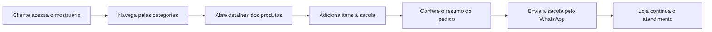
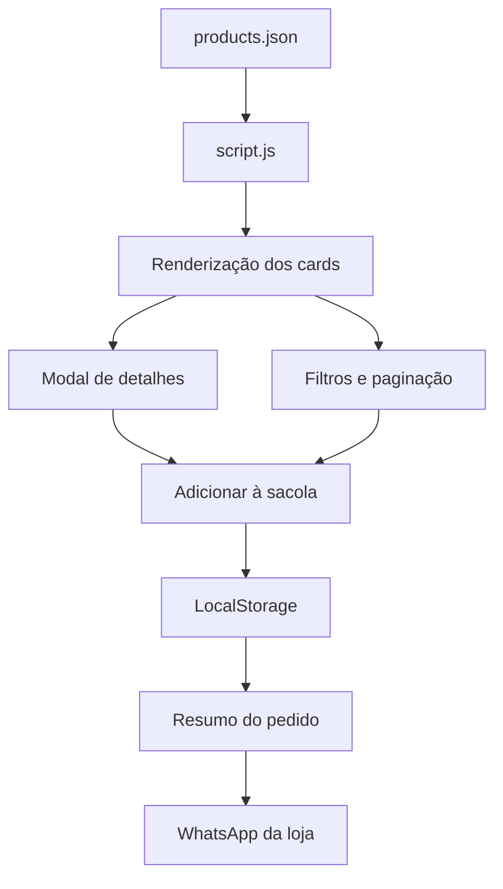

<div align="center">

# Juliana Biju

### Mostruário digital para acessórios, com catálogo dinâmico, sacola e envio de pedido pelo WhatsApp


**Projeto real desenvolvido para a marca Juliana Biju, apresentado aqui como case de portfólio.**

[Site em produção](https://jubijucomercio-spec.github.io/Juliana/)

</div>

---

## Visão Geral

O **Juliana Biju** é um mostruário digital criado para uma marca de acessórios em aço inox. O objetivo foi transformar o catálogo da loja em uma experiência online simples, bonita e prática para venda por atendimento direto.

Mais do que uma vitrine estática, o projeto permite navegar por produtos, filtrar categorias, abrir detalhes, montar uma sacola e enviar o pedido pelo WhatsApp. É uma solução leve, sem backend complexo, mas com recursos suficientes para apoiar a rotina comercial da marca.

---

## Objetivo Do Projeto

A cliente precisava de uma forma mais organizada de apresentar seus produtos sem depender apenas de fotos soltas em redes sociais ou mensagens individuais.

O site foi pensado para:

- valorizar a identidade visual da marca;
- organizar produtos por categoria;
- facilitar a escolha de peças;
- permitir que a cliente monte uma sacola;
- gerar um pedido claro para envio no WhatsApp;
- manter a atualização do catálogo simples, usando um arquivo JSON.

---

## Funcionalidades

| Módulo | Recursos |
| --- | --- |
| **Catálogo** | Produtos carregados dinamicamente a partir de `products.json` |
| **Categorias** | Filtros para brincos, colares, pulseiras, braceletes e todos |
| **Cards de produto** | Foto, nome, preço, descrição, badge e status de esgotado |
| **Modal de detalhes** | Visualização ampliada do produto e informações adicionais |
| **Sacola** | Adição, remoção, totalização e persistência local |
| **WhatsApp** | Envio do resumo do pedido diretamente para a loja |
| **Compartilhamento** | Geração de resumo de sacola por URL comprimida |
| **Paginação** | Listagem organizada para catálogos maiores |
| **Responsividade** | Experiência adaptada para celular e desktop |

---

## Fluxo Comercial



---

## Stack Técnica

| Tecnologia | Uso no projeto |
| --- | --- |
| **HTML5** | Estrutura da landing page e do catálogo |
| **CSS3** | Identidade visual, responsividade e animações |
| **JavaScript Vanilla** | Renderização do catálogo, filtros, modal, sacola e WhatsApp |
| **JSON** | Base de dados simples para produtos |
| **LocalStorage** | Persistência temporária da sacola |
| **LZ String** | Compressão dos dados da sacola para compartilhamento |
| **jsPDF / html2canvas** | Base para geração visual/exportação de resumo |

---

## Arquitetura Do Catálogo



---

## Estrutura Do Projeto

```text
.
|-- index.html
|-- styles.css
|-- script.js
|-- products.json
|-- images
|   |-- produtos
|   |-- banners
|   `-- icons
`-- README.md
```

---

## Minha Atuação

Neste projeto, desenvolvi a experiência digital da marca com foco em venda simples e atendimento direto.

O cuidado principal foi criar uma solução que a cliente pudesse usar no dia a dia sem depender de uma estrutura pesada. O catálogo é alimentado por JSON, a sacola funciona no navegador e o fechamento acontece pelo WhatsApp, que já faz parte da rotina comercial da loja.

Pontos trabalhados:

- criação da interface do mostruário;
- organização visual dos produtos;
- renderização dinâmica do catálogo;
- filtros por categoria;
- modal de detalhes;
- lógica de sacola;
- persistência com `localStorage`;
- envio de pedido formatado para WhatsApp;
- adaptação para mobile.

---

## O Que Este Projeto Demonstra

| Competência | Aplicação |
| --- | --- |
| **Frontend comercial** | Vitrine de produtos com experiência de compra guiada |
| **JavaScript prático** | Catálogo, filtros, modal, paginação e sacola sem framework |
| **Modelagem simples de dados** | Produtos organizados em JSON |
| **UX para vendas** | Fluxo do interesse ao pedido no WhatsApp |
| **Responsividade** | Navegação pensada para uso em celular |
| **Entrega real** | Projeto usado por uma marca em operação |

---

## Nota De Portfólio

Este projeto foi criado para uma cliente real e é apresentado aqui como portfólio. A proposta não é ser uma plataforma genérica de e-commerce, mas uma solução sob medida para uma operação comercial pequena, direta e muito visual.

<div align="center">

**Juliana Biju - um catálogo leve, bonito e feito para transformar interesse em pedido.**

</div>
